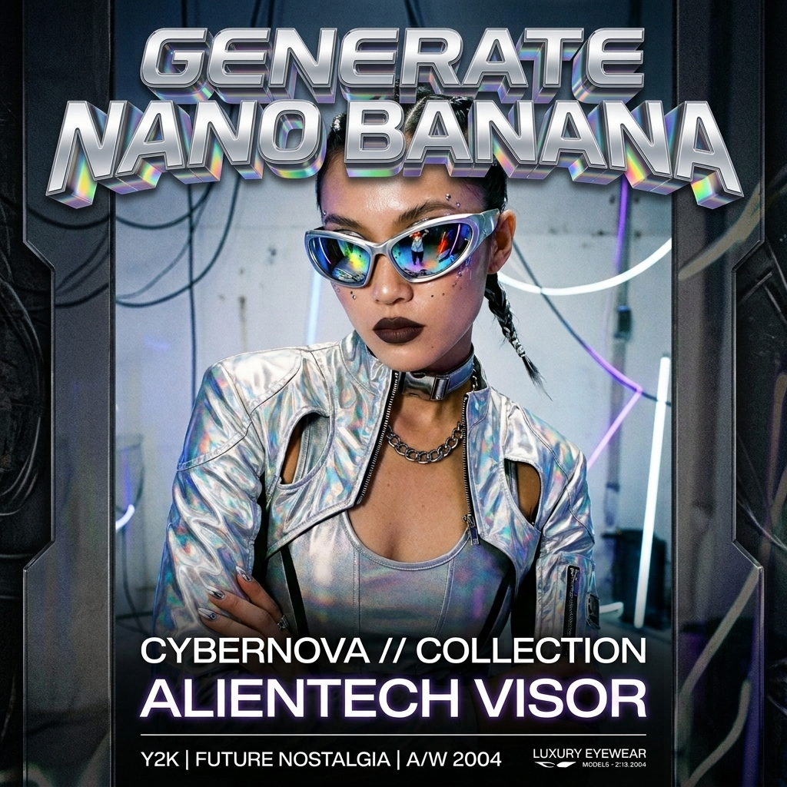

# generate-nanobanana

*Leer en otros idiomas: [English](README.md), [Español](README.es.md).*

> Skill para la generación de imágenes y videos con IA usando Google Gemini (Nano Banana 2 Lite, Nano Banana 2, Nano Banana Pro, Gemini Omni Flash). Compatible con **Antigravity**, **Gemini CLI**, **Claude Code**, **Cursor** y otros entornos de agentes. Control de costos antes de ejecuciones de pago, imágenes de referencia reales y un registro de prompts al lado de cada archivo.

Un solo comando que genera imágenes y videos a través de los modelos de medios de Gemini de Google, que nunca te sorprende con una factura inesperada y archiva cada resultado —con el prompt exacto que lo generó— en una sola carpeta.

Tú dices "genera una miniatura de X". La skill redirige el trabajo al modelo correcto (borrador económico, versión final de calidad o video), carga tus imágenes de referencia reales en lugar de describir tu logotipo con palabras, te da una cotización del costo y espera tu aprobación antes de ejecutar cualquier tarea costosa, guarda el resultado directamente en una carpeta `generations/` dentro de tu workspace y escribe una pequeña nota JSON al lado que registra el prompt, el modelo, el seed y el costo. Tres semanas después, cuando miras un archivo y piensas "¿qué prompt generó ESTO?", la respuesta estará allí mismo, justo al lado.

Diseñado exclusivamente para Google: una sola clave de API, una sola factura y las características más recientes de Gemini (fusión de múltiples imágenes de Nano Banana Pro, audio sincronizado de Omni Flash) el mismo día de su lanzamiento — sin intermediarios.

[](nanobanana_y2k_poster.png)
*Ejemplo de resultado generado con Nano Banana Pro: estética de póster Y2K.*


## Modelos

| Tarea | Modelo | ID del Modelo | Costo Estimado |
|---|---|---|---|
| Imagen (borrador) | Nano Banana 2 Lite | `gemini-3.1-flash-lite-image` | $0.03–0.05 / imagen |
| Imagen (estándar) | Nano Banana 2 | `gemini-3.1-flash-image` | $0.07–0.15 / imagen |
| Imagen (calidad) | Nano Banana Pro | `gemini-3-pro-image-preview` | $0.13–0.30 / imagen |
| Video | Gemini Omni Flash | `gemini-omni-flash-preview` | facturado por segundo — cotizado previamente |

Cada modelo tiene su propio archivo de receta en `models/` que contiene la estructura exacta de la solicitud, el manejo de respuestas y las consideraciones especiales. Cuando Google lanza un mejor modelo, simplemente agregas un archivo markdown y la skill lo aprende. Nada más cambia.

## Instalación y Agentes Compatibles

Requisitos: una [clave de API de Google AI Studio](https://aistudio.google.com/apikey) (o la integración de la herramienta integrada sin clave de **Antigravity**), y **Antigravity**, **Gemini CLI**, **Claude Code** o cualquier otro agente que lea archivos de skill.

Instala directamente usando [`npx`](https://docs.npmjs.com/cli/v7/commands/npx) mediante el [skills CLI](https://github.com/vercel-labs/skills):

```bash
npx skills add AntonioCardenas/generate-nanobanana
export GEMINI_API_KEY=your_key_here   # o agrégalo a tu perfil de shell
```

Esto utiliza `npx` con el [skills CLI](https://github.com/vercel-labs/skills), que resuelve `owner/repo` directamente a este repositorio y coloca la skill en el directorio de configuración de tu agente. Es compatible con **Antigravity**, **Gemini CLI**, **Claude Code**, **Cursor**, **Codex**, **OpenCode** y otros — selecciona tu objetivo con `-a claude-code` o `-a gemini-cli`, o agrega `-g` para instalar de forma global en lugar del proyecto actual.

Si prefieres hacerlo manualmente:

```bash
git clone https://github.com/AntonioCardenas/generate-nanobanana ~/tools/generate-nanobanana
mkdir -p ~/.claude/skills
cp -R ~/tools/generate-nanobanana ~/.claude/skills/generate
```

**Reinicia tu sesión del agente en cualquiera de los dos casos.** El detector de cambios de archivos solo cubre los directorios que existían cuando comenzó la sesión, por lo que una skill instalada a mitad de la sesión no se detectará hasta que reinicies. Si parece que la skill no existe, esta es la razón.

**Actualizar después** es un solo comando — pídeselo al agente:

```
/generate update
```

Refresca la copia instalada desde este repositorio (`git pull` para instalaciones clonadas, re-ejecutando `npx skills add` en los demás casos), te dice qué cambió y nunca toca tu carpeta `generations/` ni tus conjuntos de referencia. Reinicia la sesión después, igual que tras instalar. Volver a ejecutar el comando `npx skills add` manualmente también funciona.

Luego simplemente pregunta:

```
/generate a 16:9 thumbnail for my Angular signals article, use refs/logo.png
```

El repositorio se llama `generate-nanobanana` para que sea fácil de encontrar; la skill en sí se llama `generate`, por lo que el comando se mantiene corto.

## Cómo fluye una generación

1. **Ruteo (Route)** — selecciona el modelo para el trabajo y lee su archivo de receta antes de realizar cualquier llamada.
2. **Carga de referencias (Load references)** — carga logotipos, rostros y capturas de estilo reales desde `generations/refs/`, o un conjunto completo con nombre cuando dices "on brand" o `/ref-gen <conjunto>`. Un logotipo descrito con palabras suele salir mal; los píxeles reales no fallan.
3. **Generación (Generate)** — llama a la API de Gemini según la receta. Las imágenes responden en una sola llamada; el video requiere un proceso de envío y consulta continua (submit-then-poll).
4. **Registro (Log)** — verifica que la imagen realmente llegó al disco y luego escribe el archivo JSON de registro (sidecar) junto a ella. Sin imagen no hay sidecar — una entrada de registro es la prueba de que el archivo existe.

## Conjuntos de referencia — "generate on brand"

Registra una carpeta de recursos de marca una sola vez, y luego úsala completa con una sola frase:

```
/generate link ~/empresa/recursos-de-marca as brand
/generate on brand un banner 16:9 para el lanzamiento de la venta de otoño
/ref-gen brand una tarjeta de producto cuadrada para la misma campaña
```

Dos formas de registrar una carpeta:

- **Vincular (link)** — registra la ruta de la carpeta en `generations/refs/sets.json`. Las imágenes se leen en vivo desde donde ya están, por lo que los nuevos recursos aparecen sin volver a registrar nada.
- **Importar (import)** — copia las imágenes a `generations/refs/<nombre>/` como una instantánea estable que sobrevive si la carpeta original se mueve.

`on brand` es el atajo para el conjunto llamado `brand`; cualquier otro conjunto funciona con `/ref-gen <conjunto> …` (una ruta de carpeta directa también funciona, y la forma hablada "generate from reference `<conjunto>`" se enruta igual). La skill selecciona las imágenes relevantes para el trabajo en lugar de enviar la carpeta completa — hasta el límite de referencias de cada modelo (2 en Lite, 14 en Pro) — y el JSON de registro (sidecar) documenta exactamente qué archivos se enviaron.

Un conjunto también puede incluir un `style.md` — una descripción corta y fija del estilo visual del conjunto (paleta, iluminación, cámara, estilo de renderizado). Cuando existe, su texto se antepone **literalmente** a cada prompt generado desde ese conjunto, de modo que una serie comparte un solo lenguaje visual en lugar de desviarse un poco con cada reformulación.

¿Primera ejecución sin carpeta todavía? La skill crea `generations/refs/brand/`, te dice dónde está y espera a que agregues imágenes — no inventará tu marca a partir de una descripción de texto. Además, cada conjunto puede declarar una carpeta de salida (`output`, por ejemplo `public/images/` de tu proyecto), para que los resultados "on brand" lleguen exactamente a donde el proyecto los necesita en lugar de la carpeta `generations/` predeterminada del workspace. Las referencias y los resultados nunca se mezclan.

## Las reglas y límites (Guardrails)

Casi todo en esta skill es una restricción, y son estas restricciones las que la hacen útil en el día a día en lugar de limitarla:

- **Cotización antes de video.** El video es el flujo más costoso. La skill indica el modelo, la duración y los dólares esperados, y luego espera un consentimiento explícito. Una aprobación cubre exactamente una ejecución.
- **Borrador económico, acabado de calidad.** Itera en Nano Banana 2 Lite; vuelve a ejecutar tu favorito en Nano Banana 2, o en Pro cuando el trabajo necesite fusión de múltiples imágenes o texto denso en la imagen. Dejas de pagar precios premium por borradores desechables.
- **Referencias reales, nunca descritas.** Si falta una imagen de referencia necesaria, la skill se detiene y la solicita en lugar de aproximar tu marca a partir de una descripción de texto.
- **Con seed y registrado, para que se repita.** Cada llamada de imagen lleva un seed explícito, registrado en el sidecar y comunicado con cada resultado. "La misma imagen pero cambia el titular" reutiliza el seed y el prompt exacto registrados y cambia solo eso — en lugar de volver a sortear toda la composición y cruzar los dedos. ¿Te gustó el estilo? Di "keep that seed" (conserva ese seed) para fijarlo durante el resto de la sesión, o guárdalo en un conjunto de referencia para que todo el proyecto siga generando con él. Para series que deben coincidir entre sí (un personaje, una línea de productos), la primera imagen aprobada vuelve a entrar como referencia en cada imagen posterior.
- **Una carpeta plana, en tu workspace.** Cada archivo generado se guarda en una carpeta `generations/` en la raíz del proyecto en el que estás trabajando, sin subcarpetas — tus imágenes viven junto al código que las usa, no perdidas en tu directorio home. Cualquier galería, script o búsqueda simple en la carpeta puede leer toda la biblioteca de medios del proyecto sin configuración adicional. (¿Trabajando fuera de un proyecto? Se usa `~/generations` como respaldo para que los archivos sigan teniendo un hogar predecible.)
- **Un archivo de registro (sidecar) al lado de cada archivo.** Mismo nombre base, extensión `.json`. Ese es todo el contrato, lo que significa que ningún prompt se pierde:

```json
{
  "model": "gemini-3.1-flash-lite-image",
  "prompt": "el prompt exacto enviado",
  "reference_images": ["generations/refs/brand/logo_dark.png"],
  "reference_set": "brand",
  "params": { "aspect_ratio": "16:9", "image_size": "1K", "seed": 481047 },
  "cost": "$0.04",
  "created": "2026-07-31T14:20:00Z",
  "approved_by_user": true
}
```

## Qué hay aquí

```
SKILL.md                          el cerebro: tabla de ruteo, reglas, contrato de registro
models/
  nano-banana-2-lite.md           receta de borrador de imagen — síncrono, económico, predeterminado
  nano-banana-2.md                receta de imagen estándar — el nivel generalista para versiones finales
  nano-banana-pro.md              receta de imagen de calidad — hasta 14 imágenes de referencia
  gemini-omni-flash.md            receta de video — asíncrono (submit-then-poll), audio sincronizado
```

Después de instalar, verifica que la carpeta `models/` se haya colocado junto a `SKILL.md` en tu directorio de skills. La tabla de ruteo apunta a esos archivos de recetas, por lo que si solo se transfirió `SKILL.md`, las generaciones fallarán en el paso de "leer la receta".

## Lo que esto no es

**No es un reemplazo de Flow.** Google Flow es la interfaz creativa para estos mismos modelos: construcción de escenas toma por toma, controles de cámara, edición precisa de fotogramas. Flow es una interfaz web sin API, por lo que cuando un trabajo necesita herramientas al estilo de Flow, la skill lo indica y te redirige allí en lugar de simularlo mediante llamadas a la API.

**No es gratuito.** Las imágenes cuestan centavos, pero el video se factura por segundo y unos pocos clips pueden acumularse rápidamente. Es precisamente por eso que existe el paso de aprobación y por qué la skill nunca ejecutará un trabajo de video de forma especulativa. Monitorea tu uso durante el primer día.

**No es multiproveedor.** Sin Kling, sin Seedance, sin Sora, sin enrutamiento de respaldo entre agregadores. Esta es una decisión deliberada: una única ruta de autenticación y acceso inmediato a las funciones de Gemini, a costa de la variedad de modelos. Si necesitas modelos que no sean de Google bajo una misma clave, considera usar envoltorios tipo Higgsfield en su lugar — diferente herramienta, diferente decisión.

**Los IDs de modelos en vista previa cambiarán.** `gemini-3-pro-image-preview` y `gemini-omni-flash-preview` son nombres de vista previa. Si una llamada devuelve "model not found" (modelo no encontrado), consulta la [documentación de la API de Gemini](https://ai.google.dev/gemini-api/docs) para obtener el ID actual y actualiza el archivo de receta correspondiente. Ese es el único mantenimiento que requiere este sistema.

## Licencia

MIT (consulta el archivo `LICENSE` para más detalles).
